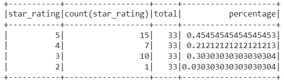
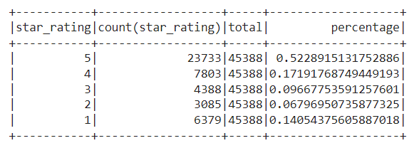
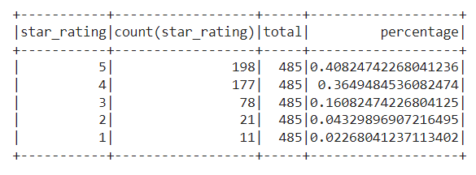
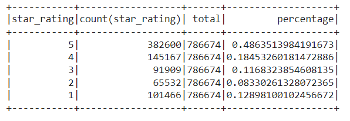

# Amazon_Vine_Analysis
### Overview of the analysis
This project is to help analyze Amazon reviews written by members of the paid Amazon Vine program. From all the reviews dataset, We picked up the 'Apparel' category. 
## Purpose
The purpose of the analysis is to understand the vine performance and overall review summary in 'Apparel' category, and figure out whether there's any positiviy bias in the vine program.

### Results
## Condition
To ensure the quality reviews collected, we followed the pre-defined condition: We picked up the reviews who have had at least 20 votes towards products, where 50% above of the votes are considered helpful, so that we can ensure the reviews included in the analysis are considered valid.

## Result Breakdown
Based on the pre-defined condition, we have following findings:
- Star ratings under paid Vine Program:

- Star ratings under unpaid group:

- There're total 45,421 reviews who meet the pre-defined conditions. Among all the qualifed reviews, we have 33 vine-reviews, and 45,388 non-Vine reviews. 
- Under the vine group, there're 15 of 5-star reviews, accounting for 45.5%; While under the non-Vine group, there're 23.733 of 5-star reviews, accounting for 52.3% of the total non-Vine reviews.

### Summary
By comparing the vine reviews and the non-vine review distributions, we didn't observe the positivity bias from the selected review datasets. The percentage of the 5-star reviews in non-vine group is even higher than that in the vine group. In addition, the 4-star and 3-star percentage in the vine group stays relatively close to the non-vine group. 
- Additional analysis
  We could also change the pre-defined condition to allow more sample data in the dataset. With setting total votes above 20, we may filter out considerable number of reviews from the current analysis. 
  For example, if we set up the bar of the total votes to 2, here're the updated number of reviews and star-rating under vine-group vs. non-vine group.

- Star ratings under paid Vine Program:

- Star ratings under unpaid group:

Having allowed more sample in the analysis, the result still remains the same. The percentage of 5-star rating in vine group is 40.8%, while the 5-star rating percentage in non-vine group is 48.6%. No significant positivity bias observed in the vine reviews.